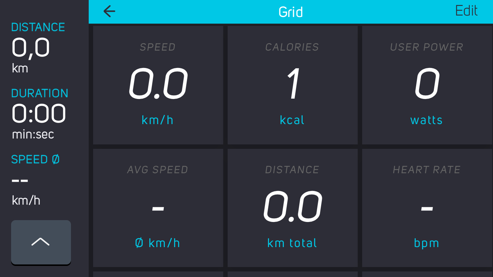

# Grid DevKit Module for COBI.bike

The DevKit Module "Grid" displays cycling and trip statistics and allows you to customize their appearance.
It's part of a collection of Open Source [modules](https://cobi.bike/devkit) for the [COBI.bike](https://cobi.bike) system.



## Quickstart: Interactive Demo

The quickest way to test the module via [Glitch.com](https://glitch.com):

[](https://glitch.com/edit/#!/import/github/cobi-bike/Module-Grid)

Glitch.com allows you to edit, host and fork Node.js applications for quick prototyping.

## Overview
This module listens to various speed and navigation events and displays it to the user. The user can zoom in and out with his thumb controller. In edit mode, he may reorder the tiles to his needs.


## Installation and Setup

You can easily deploy the module on your own:

### Step 1: Clone repository

Clone this repository and install Node.js dependencies with:

``` bash
npm install
```  

### Step 2: Install COBI.bike DevKit Simulator

Follow the [instructions](https://github.com/cobi-bike/DevKit#-test-your-module) to install the COBI.bike Google Chrome Simulator and get familiar with the basics of module development on the COBI platform.


### Step 3: Run Node.js server

The module is accessible under [localhost:3000](http://localhost:3000/) after starting the Node.js server with:
``` bash
node server.js
```  
The settings menu can be accessed with the [?state=edit](http://localhost:3000/?state=edit) suffix.


## Useful DevKit links

* [Debugging Tips & Tricks](https://github.com/cobi-bike/DevKit#debugging-tips--tricks)
* [Inspiration & Examples](https://github.com/cobi-bike/DevKit#inspiration--examples)
* [Interface Guidelines](https://github.com/cobi-bike/DevKit#interface-guidelines)
* [More DevKit Resources](https://github.com/cobi-bike/DevKit#inspiration--examples)
* [Other Tools & Resources](https://github.com/cobi-bike/DevKit#other-tools--resources)


## Contributing to this project

Anyone and everyone is welcome to contribute to this project, the [DevKit Simulator](https://github.com/cobi-bike/DevKit-Simulator) and the [DevKit UI Components](https://github.com/cobi-bike/DevKit-UI). Please take a moment to review the [guidelines for contributing](https://github.com/cobi-bike/DevKit/blob/master/CONTRIBUTING.md).

* [Bug reports](https://github.com/cobi-bike/DevKit/blob/master/CONTRIBUTING.md#bugs)
* [Feature requests](https://github.com/cobi-bike/DevKit/blob/master/CONTRIBUTING.md#features)
* [Pull requests](https://github.com/cobi-bike/DevKit/blob/master/CONTRIBUTING.md#pull-requests)

Copyright © 2018 COBI.bike GmbH
